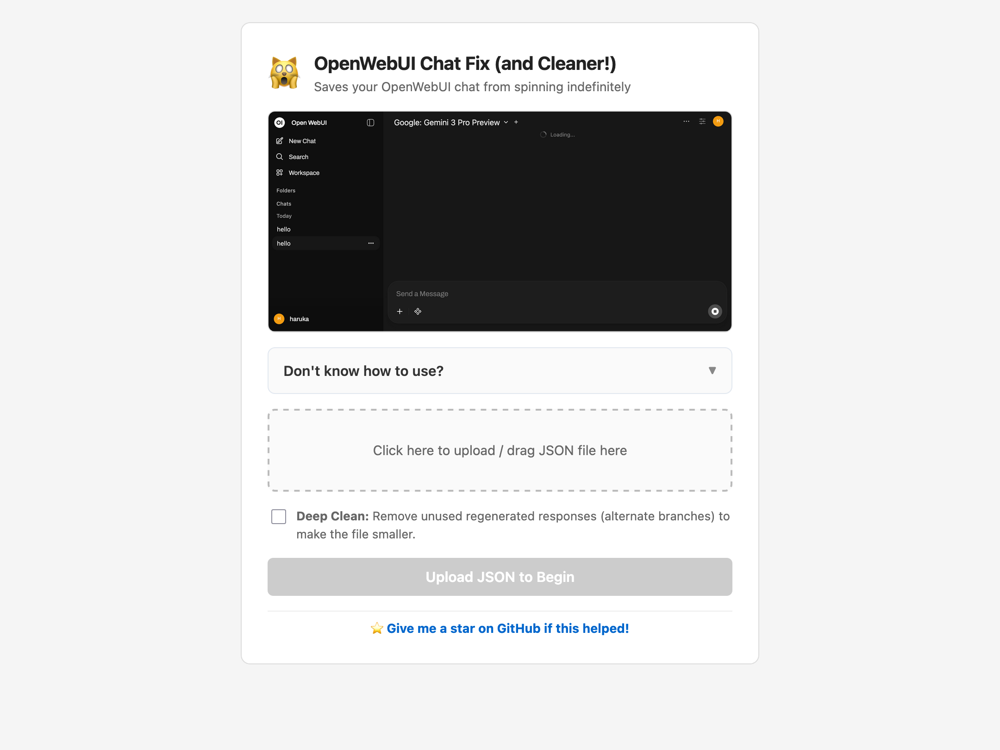
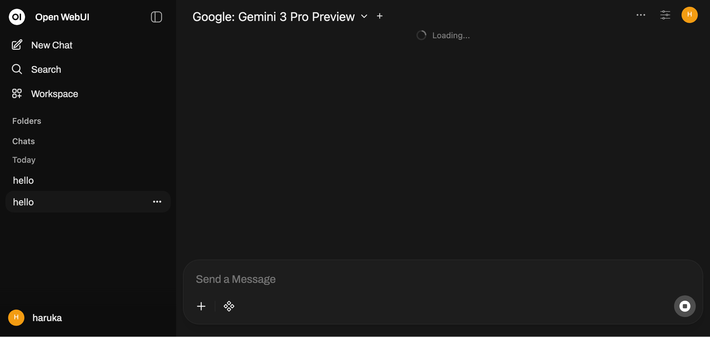

# Open WebUI Chat Repair

**Rescue Tool for Open WebUI chats that get stuck on the "Loading..." spinner.**

🔗 [**Launch the Repair Tool**](https://fractuscontext.github.io/open-webui-chat-fix/)

---

## What is this?

If you use OpenWebUI, you may have encountered a bug where a specific chat refuses to open, displaying an infinite **"Loading..."** animation (or worse, hard-crashing back to the home page).

This usually happens because the chat's internal data structure ("tree") has broken links — often due to network interruptions, API errors, or third-party tools. **This tool repairs the JSON structure so you can import your chat history back into OpenWebUI.**

Full usage instructions are built directly into the tool, just click **"Don't know how to use?"** on the page.

## Features

### Repair 🚑

- **Fixes the "Loading" Loop:** Reconnects detached messages to the main history.
- **Restores Access:** Updates the file pointers so the chat opens immediately.
- **Non-Destructive:** Keeps your *entire* history, including alternate generation branches.

### Cleaning 🧹

- **Prune Mode:** Removes unused regenerated responses (alternate branches), keeping only the active conversation path.

## Technical Context

This tool resolves `currentId` pointers that reference non-existent nodes, prunes `childrenIds` arrays of invalid/dangling IDs, and (in Deep Clean mode) rebuilds the tree along a single linear path from root to the most recently timestamped leaf.

- **Relevant GitHub Issues:** [#15189](https://github.com/open-webui/open-webui/issues/15189), [#19225](https://github.com/open-webui/open-webui/issues/19225)
- **Upstream Discussion:** [View Comment](https://github.com/open-webui/open-webui/issues/19225#issuecomment-3584231544)
- **Stack:** Pure vanilla JS. No NPM, no frameworks, no build step.

- **Test it yourself:** Import [`tests/bad-test-1.json`](./tests/bad-test-1.json) into OpenWebUI to reproduce the crash, then run it through the tool and re-import to confirm the fix.

---

**License:** GPL-3.0-or-later

Copyright © 2025-2026 [@fractuscontext](https://github.com/fractuscontext)
